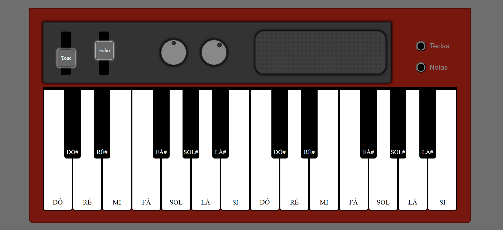
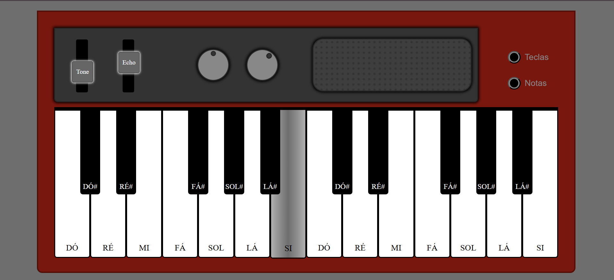
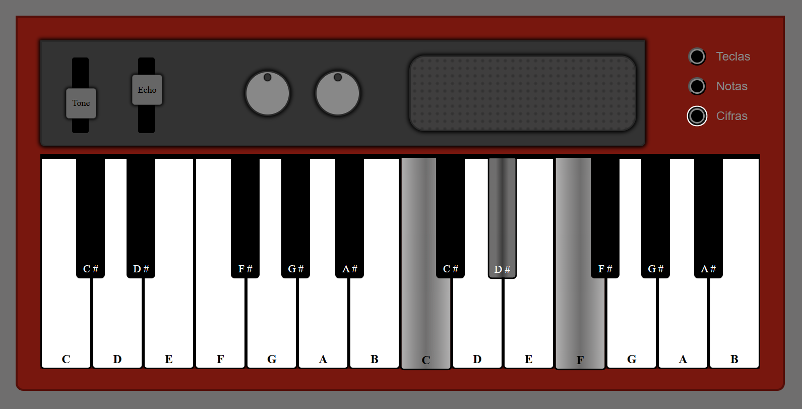

# Portfolio_Proj_002-Teclado-Piano-RED:

Este repositório faz parte de uma série de projetos que demonstram minhas habilidades técnicas e de criatividade, com foco em aplicações interativas e responsivas de desenvolvimento front-end e back-end incluídos no meu Portfólio.

# SIMULADOR DE TECLADO VIRTUAL 🎹 / PIANO VIRTUAL 🎹

## Imagens do Projeto:
<!-- style="display: flex; justify-content: center; text-align: center; gap: 20px;" -->

   
   
   
   
   

## Link do Projeto Finalizado:
* clique com o botão direito e escolha "Abrir em nova aba"  
☑️ Projeto finalizado / Deploy no GitHub Pages: https://marcia-moreira.github.io/Portfolio_Proj_002-Teclado-Piano-RED/

## Nome do Projeto: SIMULADOR TECLADO PIANO - RED
Teclado / Piano virtual, simulador para ensaio e ou aprendizado 🎹 🎼.

## Motivação para produção deste Projeto:
Projeto desenvolvido devido a necessidade de treinamento para aprimorar os estudos de teoria musical 🎼.

## Implementação de Melhorias nas Funcionalidades a partir das básicas:

- Aparência mais fidedigna à um teclado físico, com simulação de caixa de saída de som, botões de volume, tone e echo.
- Implementar seletor para mostrar as Notas Musicais em todas as teclas com opção de ocultar.
- Coloração  das teclas comdegradê.
- Responsividade para telas de celulares e tablets.

## Tecnologias Utilizadas:
<!-- https://devicon.dev/ -->

    
    &nbsp;&nbsp;&nbsp;
    
    &nbsp;&nbsp;&nbsp;
    
    &nbsp;&nbsp;&nbsp;
    
    &nbsp;&nbsp;&nbsp;
    
    &nbsp;&nbsp;&nbsp;
    
    &nbsp;&nbsp;&nbsp;
    <!--  -->
    
    &nbsp;&nbsp;&nbsp;
        
    &nbsp;&nbsp;&nbsp;
    
    &nbsp;&nbsp;&nbsp;

- **HTML5:** Estruturação do conteúdo e marcação semântica do das teclas e suas notas musicais.

- **CSS3:** Estilização visual com:
  - Animações para os botões interativos.
  - Transições suaves que simulam a movimentação dos botões quando pressionados.
  - Responsividade para diferentes dispositivos.

- **JavaScript:** Lógica do simulador e interação, incluindo:
  - Manipulação do DOM para destacar os botões durante o ensaio.
  - Uso de eventos para capturar cliques da digitação das teclas.
  - Implementação de lógicas complementares para controle de marcações de posição das teclas  x notas.

Ferramentas de apoio:
- **Git e GitHub:** Controle de versão e hospedagem do código.
- **GitHub Pages:** Para o deploy da aplicação.
- **VS Code:** Ambiente de desenvolvimento.
- **Trello:** Para organizar as etapas do projeto.

## Links e Referências  projeto inicial:
- Link projeto referência no GitHub: https://github.com/gustavopolonio/piano
- Créditos - Canal Youtube Manual do DEV

## Como Rodar o Projeto Localmente:
1. Clone o repositório:
   git clone https://github.com/Marcia-Moreira/Portfolio_Proj_002-Teclado-Piano-RED.git

## Minhas idéias de melhorias, implementadas durante o desenvolvimento:
- [ OK ] Segunda tecla, o quadradinho precisa ficar sob o bastão/trilho
- [ OK ] Quando usamos o Teclado Touch: Não conseguimos usar duas teclas ao mesmo tempo, elas não emitem som se são tecladas juntas! Rever.
- [ OK ] Aprimorar as capturas de clicks, nas telas touch e de mouse
- [ OK ] Aprimorar a coloração e descolcoração ao clicar e soltar as teclas touch.
- [    ] Os botões redondos de volume, estão identificados com a mesma ID, logo o código JS está dando erro e precisa ser ajustado para classe!
- [    ] Existe alguma forma de realmente aprimorar o codigo do volume e ele aumentar ou diminuir o volume?
- [    ] As caixas Legendas de Notas e de Teclas, estão impedindo o toque Touch que emite o som! Mesmo desativadas, parece que não deixa tocar pois estão ali efetivamente e apenas transparente.
- [    ] A parte de Botoes de Legendas das Teclas para que se mostrem ou se escondam, se cliccarmos na palavra também está ativando e desativando, não deveria acontecer, deveria funcionar apenas no botão!
- [ OK ] 🤳Verificar Responsividade em Celulares Maiores e Tablets.
- [    ] Verificar responsividade em celulares iphone de telas menores e mais antigos (Teste Udson-Senac)

## Registros da Construção 🧱:
- Desenvolvimento Web => *Marcia Moreira*
- Iniciado => 04/11/2024
- Finalizado Primeiro Deploy => 08/11/2024
- Atualização do Projeto => 08/01/2025
- WhatsApp => *+55 11 97721-9430*

    <!-- WhatsApp -->
     &nbsp;
    <!-- Linkedin -->
     &nbsp;

##
